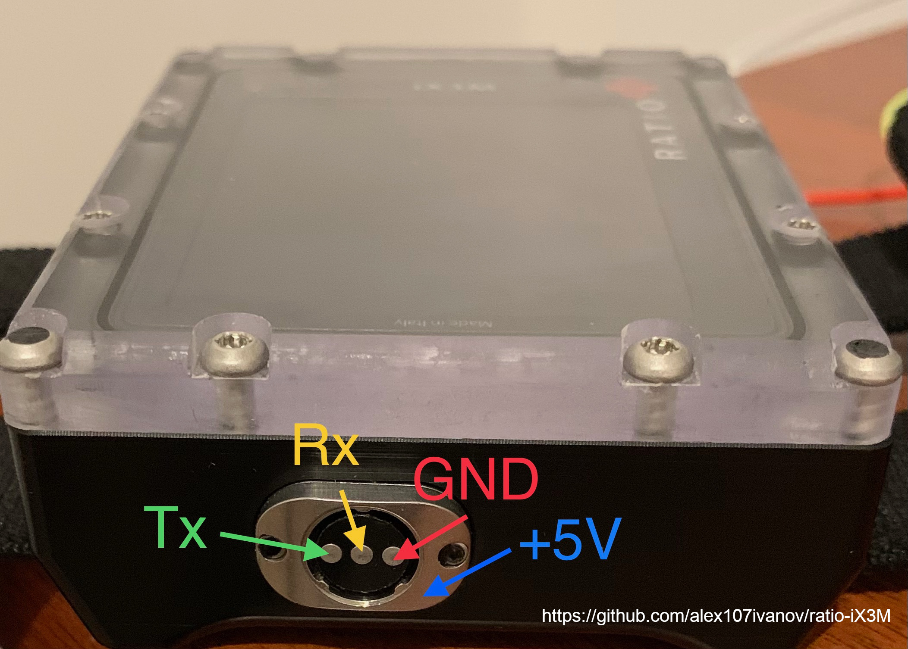

# About

Here I'm going to share all my addons, researches and information about <a href="https://www.ratio-computers.eu/en/12-ix3m-dive-computers">Ratio iX3M</a> dive computer.

You are welcome to add anything you think would be useful to other owners of this computer.

# Data connector of Ratio iX3M

To charge dive computer you need only GND and +5V connection.

For communication you need only GND Tx & Rx pins. Original cable based on <a href="https://ftdichip.com/wp-content/uploads/2020/08/DS_FT230X.pdf">FT230X</a> chip, I checked data connection with <a href="https://aliexpress.ru/item/32741917243.html?spm=a2g0o.productlist.0.0.1903338bCEAig4&algo_pvid=b89f504a-2f35-496f-b887-8a8cd27693e4&algo_expid=b89f504a-2f35-496f-b887-8a8cd27693e4-31&btsid=0b8b035a16317150159857602e89d2&ws_ab_test=searchweb0_0,searchweb201602_,searchweb201603_">CP2102</a> - <a href="https://subsurface.github.io/about/">subsurface</a> successfully imported data.

I'm going to add some STL files for protective case & data connector.